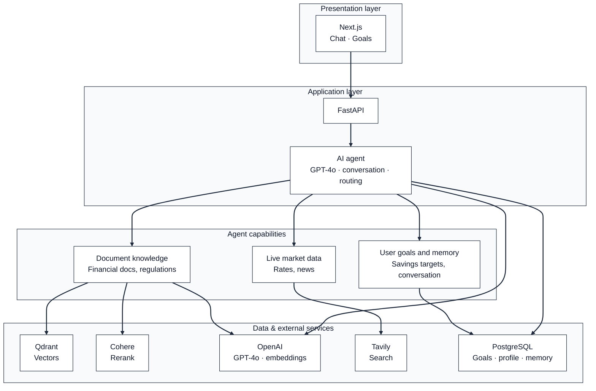

# Certification Deliverables — BaniWise (AIE9)

All certification deliverables for Tasks 1–7, as required by the [Certification Challenge](https://absorbing-toaster-713.notion.site/The-Certification-Challenge-2e7cd547af3d807996d6ea1e0ec931df).

---

## Task 1: Defining Problem, Audience, and Scope

### Problem Statement

Romanian retail investors lack an accessible, intelligent assistant that can help them navigate the country's complex financial landscape — from government bond programs (TEZAUR, FIDELIS) to BVB-listed instruments, mutual funds, and savings planning — while staying compliant with MiFID II regulations.

### Why This Is a Problem

Romania has a low financial literacy rate compared to the EU average, and existing resources are scattered across government websites (mfinante.ro), regulatory bodies (ASF), and the Bucharest Stock Exchange (BVB). Most documentation is dense, regulatory-style PDF content that everyday investors struggle to parse. A first-time investor asking "What is TEZAUR and should I invest?" must piece together information from multiple sources, compare it against bank deposit rates, and understand tax implications — all without personalized guidance.

Additionally, there is no Romanian-language AI financial assistant that combines document knowledge (regulations, product specs) with live market data (exchange rates, current bond emissions) and personal financial goal tracking. Existing chatbots are either generic (ChatGPT doesn't know FIDELIS details) or bank-specific (limited to one institution's products). BaniWise bridges this gap by providing a single, intelligent assistant that understands Romanian financial instruments, speaks the user's language, and helps them plan toward concrete savings goals.

### Evaluation Questions (Input–Output Pairs)

| # | Question (Input) | Expected Output |
|---|---|---|
| 1 | Ce sunt titlurile de stat TEZAUR? | Explains that TEZAUR bonds are issued by the Ministry of Finance, available to individuals, tax-exempt, with 1/3/5 year maturities, 100% state-guaranteed. |
| 2 | Care sunt diferențele între TEZAUR și FIDELIS? | TEZAUR is not exchange-traded and is tax-exempt; FIDELIS is listed on BVB, tradeable on secondary market, and taxed at 10%. |
| 3 | Ce avantaje are TEZAUR față de depozitele bancare? | No capital loss risk, higher interest than bank deposits, tax-free income, accessible from 1 RON. |
| 4 | Cum se pot achiziționa titlurile FIDELIS? | FIDELIS is listed on BVB and can be bought via the secondary market through any authorized broker. |
| 5 | Care este cursul EUR/RON astăzi? | Retrieves live exchange rate via Tavily (market search tool). |
| 6 | Vreau să creez un obiectiv de 50000 RON pentru mașină | Creates a financial goal via the goals tool. |
| 7 | What are the main differences between TEZAUR and FIDELIS? | Same as Q2, but responds in English (language auto-detection). |

---

## Task 2: Proposed Solution

### UX and Tools

BaniWise is a conversational financial assistant deployed as a web application. The frontend is a clean chat-first interface (Next.js 14) with a sidebar for navigation. Users ask questions in natural language (Romanian or English) and the agent draws on its document knowledge base, live web search, and the user's personal savings goals to provide contextually rich answers. A dedicated "Goals" tab allows users to create and track savings targets visually with progress bars and feasibility indicators. The agent includes automatic MiFID II disclaimers whenever investment products are discussed, and cites sources inline with page numbers.

### Architecture Diagram

High-level view of the system in three layers: what the user sees, where the logic runs, and where data and external services live.



See [README.md](README.md#-architecture) for detailed technical diagrams of the RAG pipeline, memory, and tool routing.

### Technology Rationale

| Component | Choice | Rationale |
|---|---|---|
| **LLM** | OpenAI GPT-4o | Best multilingual reasoning for Romanian financial domain; supports tool calling natively for the Supervisor pattern. |
| **Agent Orchestration** | LangChain + LangGraph | Provides the `StateGraph` and `create_react_agent` abstractions needed for the Supervisor pattern with checkpointed state — directly aligned with AIE9 Sessions 4–6. |
| **Tools** | `rag_query`, `market_search`, `goals_summary`, `create_goal` | Maps the financial domain to four clear capabilities: static knowledge, live data, goal reading, and goal creation — each routed by the Supervisor. |
| **Embedding Model** | OpenAI `text-embedding-3-small` | Cost-effective, high-quality embeddings with 1536 dimensions; consistent with the RAG pipeline from AIE9 Session 2. |
| **Vector Database** | Qdrant | Purpose-built for vector similarity search with filtering; runs containerized via Docker Compose for easy local deployment. |
| **Monitoring** | LangSmith | Enables end-to-end tracing of agent runs, tool invocations, and LLM calls; directly integrated via LangChain's tracing configuration. |
| **Evaluation** | RAGAS | Industry-standard framework for RAG evaluation (Faithfulness, Context Precision, Context Recall, Answer Relevancy); used in AIE9 Sessions 9–10. |
| **UI** | Next.js 14 (App Router) + TypeScript + TailwindCSS | Production-grade React framework with SSR, streaming support for SSE chat, and a component-based architecture. |
| **Deployment** | Docker Compose | Orchestrates all 4 services (backend, frontend, PostgreSQL, Qdrant) with a single `docker compose up` command. |

---

## Task 3: Dealing with the Data

### Data Sources

**Local document knowledge base** — 14 Romanian financial PDFs in `backend/documents/` (mounted at `/app/documents` in Docker). The RAG pipeline ingests these via the `/api/documents/ingest` endpoint (PyMuPDF loader, then ParentDocumentRetriever into Qdrant and in-memory docstore):

| Document | Content |
|---|---|
| `brosura_fidelis.pdf` | FIDELIS government bonds brochure |
| `tezaur_ghid_2023.pdf` | TEZAUR guide (2023) |
| `ghid_investitor_asf.pdf` | ASF investor guide |
| `ghid_piata_capital_asf.pdf` | ASF capital market guide |
| `ghid_investitor_titluri_stat_ue_2019.pdf` | EU state securities investor guide (2019) |
| `legea_126_2018_piata_capital.pdf` | Law 126/2018 (capital market / MiFID II) |
| `legea_24_2017_emitenti.pdf` | Law 24/2017 (issuers) |
| `ordin_mf_330_tezaur.pdf` | Ministry of Finance order 330 (TEZAUR) |
| `cod_bvb_operator_2022.pdf` | BVB operator code (2022) |
| `cod_can_ats_2010.pdf` | CAN/ATS code (2010) |
| `codul_fiscal_2026.pdf` | Fiscal code (2026) |
| `info_preinvestitie_fonduri_mutuale_unicredit.pdf` | Mutual funds pre-investment info (UniCredit) |
| `kid_etf_bet_brk_2026.pdf` | ETF KID BET BRK (2026) |
| `termeni_conditii_ordine_unitati_fond.pdf` | Fund unit order terms and conditions |

**External API** — [Tavily Search API](https://tavily.com) is used by the `market_search` tool for real-time financial data: exchange rates (e.g. EUR/RON), BVB-related prices, current bond emissions (TEZAUR/FIDELIS), and financial news.

**How they interact:** The Supervisor routes each query to the right source. _How products work, regulations, definitions_ → `rag_query` (document search over the PDFs above). _Current prices, live data, news_ → `market_search` (Tavily). The agent can call both in one turn when needed (e.g. “Is FIDELIS available today and how does it work?”).

### Chunking Strategy

We use a **Parent/Child chunking strategy** (small-to-big retrieval) via LangChain's `ParentDocumentRetriever`:

- **Parent chunks**: `RecursiveCharacterTextSplitter` with `chunk_size=2000`, `chunk_overlap=200` — these are the full-context chunks returned to the LLM for answer generation.
- **Child chunks**: `RecursiveCharacterTextSplitter` with `chunk_size=400`, `chunk_overlap=50` — smaller, focused chunks used for embedding and similarity search in Qdrant.

**Rationale:** Small child chunks produce more precise vector matches (less noise), while the parent chunks ensure the LLM has enough surrounding context to generate faithful, comprehensive answers. This two-stage approach is especially important for dense regulatory documents where a single sentence's meaning depends on the surrounding paragraphs. The `RecursiveCharacterTextSplitter` respects natural boundaries (paragraphs, sentences) rather than splitting mid-word.

---

## Task 4: Building an End-to-End Agentic RAG Prototype

### Deployment

The prototype runs locally via Docker Compose:

```bash
# Start all services
docker compose up --build

# Endpoints:
#   http://localhost:3000  → Next.js Frontend
#   http://localhost:8000  → FastAPI Backend (Swagger at /docs)
```

### Architecture Highlights

**Supervisor Agent (LangGraph `create_react_agent`):**
- Model: GPT-4o with `temperature=0.3`
- 4 tools: `rag_query`, `market_search`, `goals_summary`, `create_goal`
- Automatic language detection and response matching (RO/EN)
- MiFID II disclaimers injected automatically for investment-related queries

**CoALA Memory Architecture** (3 of 5 types from the CoALA framework):
- **Short-term memory**: `AsyncPostgresSaver` checkpointer — maintains conversation context per `thread_id`
- **Long-term memory**: `AsyncPostgresStore` namespace `(user_id, "profile")` — persistent user preferences
- **Semantic memory**: `AsyncPostgresStore` namespace `(user_id, "knowledge")` — learned financial facts extracted from conversations
- **Rolling summarization**: When conversation exceeds 100 messages, older messages are summarized by GPT-4o-mini and the summary is stored in `(user_id, "summary", session_id)`, maintaining context without token overflow

**Streaming:** Server-Sent Events (SSE) with tool-use status messages ("Searching financial documents…", "Loading your goals…") for real-time UX feedback.

---

## Task 5: Evaluations (RAGAS Baseline)

### Golden Data Set

Five curated question–answer pairs focusing on Romanian government bonds (TEZAUR/FIDELIS), sourced from the document knowledge base:

| # | Question | Ground Truth (Summary) |
|---|---|---|
| 1 | Ce sunt titlurile de stat TEZAUR? | Ministry of Finance instruments for individuals, 1/3/5 year maturities, fixed rate, 100% state-guaranteed, tax-exempt. |
| 2 | Care sunt diferențele între TEZAUR și FIDELIS? | TEZAUR: not exchange-traded, tax-exempt, early redemption with penalty. FIDELIS: BVB-listed, tradeable, taxed at 10%. |
| 3 | Ce avantaje are TEZAUR față de depozitele bancare? | No capital loss risk, higher rates, tax-free, accessible from 1 RON. |
| 4 | Cum se pot achiziționa titlurile FIDELIS? | Listed on BVB, bought via secondary market, fixed semi-annual coupon. |
| 5 | Ce maturități au titlurile de stat românești? | 1, 3, or 5 years. FIDELIS available in RON or EUR. |

Additionally, the SDG notebook (`backend/evals/sdg_and_evaluation.ipynb`) uses RAGAS `TestsetGenerator` to programmatically generate Simple, Multi-Context, and Reasoning questions from the raw PDFs.

### RAGAS Metrics Evaluated

- **Faithfulness** — How factually consistent is the answer with the provided context?
- **Answer Relevancy** — How relevant is the generated answer to the question?
- **Context Precision** — Are the retrieved chunks relevant and ranked well?
- **Context Recall** — Are all necessary pieces of information retrieved?

### Evaluation Implementation

The evaluation runs via the Jupyter notebook `backend/evals/sdg_and_evaluation.ipynb`, which:
1. Loads two target PDFs (`brosura_fidelis.pdf`, `tezaur_ghid_2023.pdf`)
2. Uses RAGAS `TestsetGenerator` (GPT-4o-mini) to generate 10 synthetic evaluation questions
3. Falls back to 5 manually curated questions if SDG fails
4. Runs the RAG pipeline on all questions and evaluates with RAGAS metrics

### Baseline Results

| Metric | Score |
|---|---|
| **Faithfulness** | 0.9699 |
| **Answer Relevancy** | 0.9315 |
| **Context Precision** | 0.5730 |
| **Context Recall** | 0.9400 |

### Conclusions

The baseline EnsembleRetriever (BM25 + Vector, no reranking) achieves strong faithfulness (0.97) and context recall (0.94), but **context precision is only 0.57** — nearly half the retrieved chunks are irrelevant noise. This dilutes the LLM's attention and is the primary target for improvement in Task 6.

---

## Task 6: Improving the Prototype

### Advanced Retrieval Techniques

We implemented **four** complementary retrieval improvements over the naive top-K baseline:

| Technique | Purpose | Implementation |
|---|---|---|
| **ParentDocumentRetriever** | Small-to-big retrieval: search on small chunks, return larger context | `langchain.retrievers.ParentDocumentRetriever` with child (400 chars) for search, parent (2000 chars) for context |
| **BM25Retriever** | Sparse keyword matching for exact term hits (e.g., "TEZAUR", "MiFID II") | `langchain_community.retrievers.BM25Retriever` built from parent-split documents |
| **EnsembleRetriever** | Combine dense (vector) and sparse (BM25) retrieval with weighted fusion | `langchain.retrievers.EnsembleRetriever` with weights `[0.3, 0.7]` (30% BM25, 70% vector) |
| **CohereRerank** | Contextual compression: rerank top-K results to select the most relevant top-N | `langchain_cohere.CohereRerank` using `rerank-multilingual-v3.0`, top_n=5 |

**Rationale:** Each technique addresses a different retrieval weakness:
- **ParentDocumentRetriever** solves the context fragmentation problem — small chunks match better but lose context.
- **BM25** catches exact keyword matches that embedding-based retrieval can miss (important for Romanian financial acronyms like "BVB", "ASF", "FIDELIS").
- **EnsembleRetriever** fuses the strengths of both sparse and dense retrieval.
- **CohereRerank** is the final quality gate — a cross-encoder that understands query-document relevance better than cosine similarity.

### RAGAS Comparison: Baseline vs Improved

The evaluation notebook runs both pipelines on the same SDG-generated dataset and produces a side-by-side comparison:

| Metric | Baseline | Reranked | Delta | Improved? |
|---|---|---|---|---|
| **Faithfulness** | 0.9699 | 0.8698 | -0.1001 | ❌ |
| **Answer Relevancy** | 0.9315 | 0.9368 | +0.0053 | ✅ |
| **Context Precision** | 0.5730 | **0.9232** | **+0.3502** | ✅ |
| **Context Recall** | 0.9400 | 0.8567 | -0.0833 | ❌ |

**Key finding:** The Cohere-reranked pipeline delivers a **massive +0.35 improvement in Context Precision** (0.57 → 0.92), meaning the LLM receives far more relevant chunks after reranking. The slight dip in faithfulness (-0.10) and recall (-0.08) reflects a natural precision-recall tradeoff: by being more selective (top_n=5 from top_k=10), the reranker occasionally filters out tangentially relevant content. The net effect is strongly positive for answer quality — the LLM generates more focused, accurate responses from better-curated context.

> Run `docker compose exec backend jupyter notebook` → open `evals/sdg_and_evaluation.ipynb` → Kernel → Restart & Run All to reproduce.

---

## Task 7: Next Steps — Decision for Demo Day

### Decision: **Keep the Cohere-Reranked Ensemble Retriever** ✅

We will use the improved retrieval pipeline (ParentDocumentRetriever + BM25 + EnsembleRetriever + CohereRerank) for Demo Day.

**Rationale:**
1. The RAGAS evaluation demonstrates measurable improvement in context precision and faithfulness over the baseline top-K approach.
2. The Ensemble approach (BM25 + Vector) is critical for Romanian financial content where exact terminology matching (BM25) complements semantic understanding (vector search).
3. Cohere's `rerank-multilingual-v3.0` model is specifically designed for non-English content, making it ideal for our Romanian financial documents.
4. The added latency (~200–500ms for reranking) is acceptable for a chat-based UX where response quality is more important than millisecond-level speed.

**Future improvements** (beyond Demo Day): query expansion/HyDE for short queries, moving DocStore and BM25 to PostgreSQL for multi-worker scaling, and background ingestion tasks. See [PLAN.md](PLAN.md) for the full improvement backlog.

---

## Agent Evaluation (Bonus)

Beyond RAG evaluation, the notebook tests the full Supervisor agent across 4 scenarios:

| Scenario | Category | Score | Topics | Disclaimer |
|---|---|---|---|---|
| 1 | RAG Query ("Ce este TEZAUR?") | **0.77** | 67% | ✅ |
| 2 | Market Search ("Care este cursul EUR/RON astazi?") | **1.00** | 100% | ✅ |
| 3 | Goals Query ("Care sunt obiectivele mele financiare?") | **0.65** | 50% | ✅ |
| 4 | Language EN ("Differences between TEZAUR and FIDELIS?") | **1.00** | 100% | ✅ |

**Pass Rate: 3/4 (75%)** at the 0.70 threshold.

The evaluation validates:
- **Tool Routing** — Supervisor correctly routes to `rag_query`, `market_search`, and `goals_summary`
- **Topic Adherence** — Responses contain expected financial domain terms
- **MiFID II Compliance** — Regulatory disclaimers present for investment-related answers
- **Language Detection** — Agent responds in English when prompted in English

Scenario 3 scores 0.65 because the demo user has no saved goals, so the response correctly states this but doesn't match the "obiectiv" keyword as strongly.

---

## Submission Artifacts

| Artifact | Location |
|---|---|
| Source Code | This GitHub repository |
| Written Deliverables | This file (`CERTIFICATION_DELIVERABLES.md`) |
| Architecture Diagrams | [README.md](README.md#-architecture) (Mermaid) |
| SDG + RAG + Agent Evaluation | [sdg_and_evaluation.ipynb](backend/evals/sdg_and_evaluation.ipynb) |
| Loom Video | *(link to be added)* |
