# BaniWise — Personal Financial Agent 🇷🇴

**AI-powered financial assistant for Romanian investors** — built as a certification challenge for the AI Engineering Bootcamp (AIE9).

This project demonstrates advanced mastery of **Retrieval-Augmented Generation (RAG)**, **Agentic Workflows (LangGraph)**, **Evaluations (RAGAS)**, and **Synthetic Data Generation**. 

## 🧠 Core AI Technologies

### 1. LangGraph Supervisor Agent ("BaniWise")
The heartbeat of the system is a **Supervisor Agent Pattern** powered by `GPT-4o`. It intelligently routes user queries to specialized tools:
- **`rag_query`**: Searches Romanian financial documents (TEZAUR, FIDELIS, BVB guides).
- **`market_search`**: Live financial data and news retrieval via the **Tavily Search API**.
- **`goals_*`**: Interface with the PostgreSQL database to manage and track user savings goals.

### 2. CoALA Memory Architecture
Implements 3 of the 5 cognitive memory types from the CoALA framework using LangGraph's new Postgres checkpointers:
- **Short-Term Memory**: Conversation thread context (`AsyncPostgresSaver`).
- **Long-Term Memory**: Persistent user profile and preferences (`AsyncPostgresStore` namespace).
- **Semantic Memory**: Learned financial facts about the user (`AsyncPostgresStore` namespace).

### 3. Advanced RAG Pipeline with Reranking
A highly optimized document retrieval system designed to ingest and query Romanian financial PDFs:
- **Ingestion**: Document parsing via `PyMuPDFLoader` and intelligent chunking (`RecursiveCharacterTextSplitter`).
- **Vector Storage**: `text-embedding-3-small` embeddings stored securely in a **Qdrant Vector DB**.
- **Contextual Compression**: Two-stage retrieval using **Cohere Rerank** (`rerank-multilingual-v3.0`). Searches pull the top-K documents from Qdrant, which Cohere then reranks to provide the precise top-N most contextually relevant chunks to the LLM.

### 4. Synthetic Data Generation (SDG) & Evaluation (RAGAS)
The `backend/evals/` directory contains a robust, programmatic evaluation suite:
- **Synthetic Data Generation**: Automates the creation of test sets from the raw PDFs using RAGAS `TestsetGenerator`. Produces Simple, Multi-Context, and Reasoning questions.
- **RAG Evaluation**: Uses **RAGAS** metrics (*Faithfulness, Answer Relevancy, Context Precision/Recall*) to mathematically prove the performance delta between a baseline top-K pipeline vs. the Cohere-reranked pipeline.
- **Agent Evaluation**: Custom programmatic evaluation testing the Supervisor model on Tool Routing accuracy, Topic Adherence, and **MiFID II Regulatory Compliance**.

---

## 🏗 Architecture

<p align="center">
  
</p>

## 🛠 Tech Stack

| Layer | Technology |
|---|---|
| **LLM Models** | OpenAI GPT-4o (Supervisor) & GPT-4o-mini |
| **Agent Framework** | LangChain + LangGraph |
| **Vector DB** | Qdrant |
| **Embeddings** | OpenAI `text-embedding-3-small` |
| **Reranking** | Cohere `rerank-multilingual-v3.0` |
| **Web Search** | Tavily API |
| **Evaluation Suite** | RAGAS (`ragas`) + JupyterSDG |
| **Backend API** | FastAPI (Python 3.11) |
| **Frontend** | Next.js 14 + TypeScript + TailwindCSS |
| **Relational DB** | PostgreSQL 16 (sqlalchemy / asyncpg) |

---

## 🚀 Quick Start

```bash
# 1. Copy environment template and add your API keys (OpenAI, Cohere, Tavily)
cp .env.example .env

# 2. Start all services using Docker Compose
docker compose up --build

# 3. Verify services are running
open http://localhost:8000/docs   # FastAPI Swagger UI
open http://localhost:3000        # Next.js Frontend
```

## 📁 Project Structure

```text
├── backend/
│   ├── app/
│   │   ├── main.py          # FastAPI application entry point
│   │   ├── api/             # REST API routers (chat, goals, docs, users)
│   │   ├── models/          # SQLAlchemy ORM models
│   │   ├── schemas.py       # Pydantic validation schemas
│   │   └── services/
│   │       ├── agent_service.py # LangGraph Supervisor & CoALA Memory
│   │       ├── rag_service.py   # Qdrant + Cohere Contextual Compression
│   │       └── goals_service.py # Financial PostgreSQL logic
│   ├── documents/           # Romanian financial PDFs (Knowledge Base)
│   └── evals/
│       ├── sdg_and_evaluation.ipynb # Full SDG + Eval interactive walkthrough
│       ├── eval_rag.py      # Automated RAGAS baseline vs reranked tests
│       └── eval_agent.py    # Automated Agent routing & compliance tests
├── frontend/                # Next.js 14 Chat & Goals UI
├── docker-compose.yml       # Production-ready container orchestration
└── .env.example
```

## 🔌 Core API Endpoints

| Method | Endpoint | Description |
|---|---|---|
| `POST` | `/api/chat` | Streaming endpoint chatting directly with the LangGraph Agent |
| `GET` | `/api/chat/history/{session_id}` | Retrieves CoALA Short-Term memory history |
| `POST` | `/api/documents/ingest` | Triggers the RAG Pipeline to chunk and embed new PDFs |
| `GET` | `/api/goals?user_id=` | Fetches financial savings goals from PostgreSQL |
| `POST` | `/api/goals?user_id=` | Creates a new financial goal |

## 📜 License

[MIT License](LICENSE)
