# BaniWise — Personal Financial Agent 🇷🇴

**AI-powered financial assistant for Romanian investors** — built as a certification challenge for the AI Engineering Bootcamp (AIE9).

This project demonstrates advanced mastery of **Retrieval-Augmented Generation (RAG)**, **Agentic Workflows (LangGraph)**, **Evaluations (RAGAS)**, and **Synthetic Data Generation**. Written deliverables and task-by-task answers: **[CERTIFICATION_DELIVERABLES.md](CERTIFICATION_DELIVERABLES.md)**.

## 🧠 Core AI Technologies

### 1. LangGraph Supervisor Agent ("BaniWise")
The heartbeat of the system is a **Supervisor Agent Pattern** powered by `GPT-4o`. It intelligently routes user queries to specialized tools:
- **`rag_query`**: Searches Romanian financial documents (TEZAUR, FIDELIS, BVB guides).
- **`market_search`**: Live financial data and news retrieval via the **Tavily Search API**.
- **`goals_*`**: Interface with the PostgreSQL database to manage and track user savings goals.
- **`savings_insights`**: Uses anonymized transaction data (spending by category, fees, recurring) to suggest where the user can save; powered by uploaded CSV bank statements and detailed categorization (fees, shopping, transport, health, etc.).

### 2. CoALA Memory Architecture
Implements 3 of the 5 cognitive memory types from the CoALA framework using LangGraph's new Postgres checkpointers:
- **Short-Term Memory**: Conversation thread context (`AsyncPostgresSaver`).
- **Long-Term Memory**: Persistent user profile and preferences (`AsyncPostgresStore` namespace).
- **Semantic Memory**: Learned financial facts about the user (`AsyncPostgresStore` namespace).

### 3. Advanced RAG Pipeline with Reranking
A highly optimized document retrieval system designed to ingest and query Romanian financial PDFs:
- **Ingestion**: Document parsing via `PyMuPDFLoader` and intelligent chunking (`RecursiveCharacterTextSplitter`).
- **Vector Storage**: `text-embedding-3-small` embeddings stored securely in a **Qdrant Vector DB**.
- **Contextual Compression**: Two-stage retrieval using **Cohere Rerank** (`rerank-multilingual-v3.0`). Searches pull the top-K documents from Qdrant, which Cohere then reranks to provide the precise top-N most contextually relevant chunks to the LLM.

### 4. Synthetic Data Generation (SDG) & Evaluation (RAGAS)
The `backend/evals/` directory contains a robust, programmatic evaluation suite:
- **Synthetic Data Generation**: Automates the creation of test sets from the raw PDFs using RAGAS `TestsetGenerator`. Produces Simple, Multi-Context, and Reasoning questions.
- **RAG Evaluation**: Uses **RAGAS** metrics (*Faithfulness, Answer Relevancy, Context Precision/Recall*) to mathematically prove the performance delta between a baseline top-K pipeline vs. the Cohere-reranked pipeline.
- **Agent Evaluation**: Custom programmatic evaluation testing the Supervisor model on Tool Routing accuracy, Topic Adherence, and **MiFID II Regulatory Compliance**.

---

## 🏗 Architecture

### AI System Overview

End-to-end stack: Frontend → FastAPI → LangGraph Supervisor → Tools & CoALA Memory.

```mermaid
flowchart TB
    subgraph Client["🖥️ Client Layer"]
        FE[Next.js Frontend]
    end

    subgraph API["⚡ Backend API"]
        FastAPI[FastAPI]
        ChatAPI["/api/chat"]
        DocsAPI["/api/documents/ingest"]
        GoalsAPI["/api/goals"]
        TransactionsAPI["/api/transactions"]
        FastAPI --> ChatAPI
        FastAPI --> DocsAPI
        FastAPI --> GoalsAPI
        FastAPI --> TransactionsAPI
    end

    subgraph Agent["🧠 AI Agent Layer"]
        Supervisor[LangGraph Supervisor<br/>GPT-4o]
        Tools[Specialist Tools]
        Supervisor --> Tools
    end

    subgraph ToolsDetail[" "]
        RAG[rag_query]
        Market[market_search]
        GoalsTool[goals_summary<br/>create_goal]
        SavingsTool[savings_insights]
        Tools --> RAG
        Tools --> Market
        Tools --> GoalsTool
        Tools --> SavingsTool
    end

    subgraph Memory["📦 CoALA Memory"]
        STM[Short-Term<br/>AsyncPostgresSaver]
        LTM[Long-Term<br/>Profile Store]
        SEM[Semantic<br/>Knowledge Store]
    end

    subgraph External["☁️ External Services"]
        OpenAI[OpenAI API<br/>GPT-4o / Embeddings]
        Qdrant[Qdrant<br/>Vector DB]
        Cohere[Cohere<br/>Reranker]
        Tavily[Tavily<br/>Web Search]
        Ollama[Ollama<br/>Mistral · transaction categories]
        PG[(PostgreSQL)]
    end

    FE -->|HTTP/SSE| FastAPI
    ChatAPI --> Supervisor
    DocsAPI --> RAG
    GoalsAPI --> PG
    TransactionsAPI --> PG
    TransactionsAPI -.->|optional| Ollama

    Supervisor <-->|context & history| Memory
    RAG --> Qdrant
    RAG --> Cohere
    RAG --> OpenAI
    Market --> Tavily
    GoalsTool --> PG
    SavingsTool --> PG
    Supervisor -->|completion| OpenAI
```



### RAG Pipeline

Ingestion (PDF → Qdrant + BM25) and retrieval (Ensemble → Cohere Rerank).


### CoALA Memory

Short-term, long-term, semantic memory and rolling summarization.


### Agent Tool Routing

Supervisor routing to `rag_query`, `market_search`, `goals_summary`, `create_goal`, `savings_insights`.


### Transaction import and categorization

Bank statement CSV upload (Transactions page) is parsed, categorized (Mistral via Ollama or rule-based fallback), anonymized, and stored in PostgreSQL. The agent uses `savings_insights` to summarize spending by category and suggest where to save.

```mermaid
flowchart LR
    subgraph Upload["📤 Upload"]
        CSV[CSV Bank Statement]
        Parser[Transaction Parser<br/>BRD · BCR · Raiffeisen · ING]
        CSV --> Parser
    end

    subgraph Categorize["🏷️ Categorize"]
        Check{Ollama<br/>available?}
        OllamaSvc[Ollama<br/>Mistral model]
        Rules[Rule-based fallback]
        Mistral[Mistral categories]
        RuleCats[Same category set]
        Parser --> Check
        Check -->|yes| OllamaSvc --> Mistral
        Check -->|no| Rules --> RuleCats
    end

    subgraph Store["📦 Store"]
        Anon[Anonymizer]
        PG_TX[(PostgreSQL<br/>Transactions)]
        Mistral --> Anon
        RuleCats --> Anon
        Anon --> PG_TX
    end
```



**Transaction categories** (detailed; used by both Mistral and rule-based fallback):

| Group | Categories |
|-------|------------|
| **Fees** | `ACCOUNT_MAINTENANCE_FEE`, `ATM_FEE`, `TRANSFER_FEE`, `CARD_FEE`, `OVERDRAFT_FEE`, `LOAN_INTEREST_FEE`, `FOREIGN_EXCHANGE_FEE`, `OTHER_FEE` |
| **Shopping** | `ELECTRONICS_SHOPPING`, `CLOTHING_SHOPPING`, `HOME_GARDEN_SHOPPING`, `BEAUTY_AND_PERSONAL_CARE`, `OTHER_SHOPPING` |
| **Transport** | `FUEL_TRANSPORT`, `PUBLIC_TRANSPORT`, `TAXI_AND_RIDESHARE`, `PARKING_AND_TOLLS`, `CAR_MAINTENANCE`, `OTHER_TRANSPORT` |
| **Health** | `PHARMACY_HEALTH`, `DOCTOR_AND_CLINIC`, `DENTAL_HEALTH`, `OPTICS_HEALTH`, `HEALTH_INSURANCE`, `OTHER_HEALTH` |
| **Other** | `SUBSCRIPTION`, `GROCERIES`, `DINING`, `UTILITIES`, `OTHER` |

Diagrams are defined in Mermaid in this README and in [CERTIFICATION_DELIVERABLES.md](CERTIFICATION_DELIVERABLES.md).


## 🛠 Tech Stack

| Layer | Technology |
|---|---|
| **LLM Models** | OpenAI GPT-4o (Supervisor) & GPT-4o-mini |
| **Agent Framework** | LangChain + LangGraph |
| **Vector DB** | Qdrant |
| **Embeddings** | OpenAI `text-embedding-3-small` |
| **Reranking** | Cohere `rerank-multilingual-v3.0` |
| **Web Search** | Tavily API |
| **Evaluation Suite** | RAGAS (`ragas`) + Jupyter notebook for SDG and evals |
| **Backend API** | FastAPI (Python 3.11) |
| **Frontend** | Next.js 14 + TypeScript + TailwindCSS |
| **Relational DB** | PostgreSQL 16 (sqlalchemy / asyncpg) |

---

## Prerequisites

- **Docker** and **Docker Compose** (recommended: run everything in containers).
- For local development without Docker: **Python 3.11**, **Node 18+**, and a `.env` file with the required API keys.

## Environment variables

Copy the template and set your API keys:

```bash
cp .env.example .env
```

Required for the agent and RAG:

| Variable | Description |
|----------|--------------|
| `OPENAI_API_KEY` | OpenAI API key (Supervisor + embeddings) |
| `COHERE_API_KEY` | Cohere API key (reranking) |
| `TAVILY_API_KEY` | Tavily API key (market search) |

Optional: `LANGSMITH_API_KEY` (tracing), `POSTGRES_*` / `DATABASE_URL`, `QDRANT_*`. See [.env.example](.env.example) for defaults.

**Optional: Ollama (Mistral) for transaction categorization** — When you upload CSV transactions, the app can use a local Mistral model via Ollama to assign **detailed categories** (fees, shopping, transport, health, groceries, etc.). If Ollama is not running, it falls back to rule-based categorization with the same category set. See [Optional: Ollama + Mistral](#optional-ollama--mistral) below.

## 🚀 Quick Start

```bash
# 1. Copy environment template and add your API keys (see Environment variables above)
cp .env.example .env

# 2. Start all services using Docker Compose
docker compose up --build

# 3. Run the evaluation notebook (SDG + RAGAS + Agent evals)
docker compose exec backend jupyter notebook \
  --ip=0.0.0.0 --port=8888 --no-browser --allow-root \
  --NotebookApp.token='' --notebook-dir=/app
# Then open http://localhost:8888 and navigate to evals/sdg_and_evaluation.ipynb → Kernel → Restart & Run All

# 4. Verify services are running (open in your browser)
#    http://localhost:8000/docs   — FastAPI Swagger UI
#    http://localhost:3000       — Next.js Frontend

# 5. Ingest documents so the agent can answer from the financial PDFs
#    POST http://localhost:8000/api/documents/ingest  (or use the Documents tab in the UI)
```

### Optional: Ollama + Mistral

To use **Mistral** for transaction categorization (Transactions → upload CSV):

**Option A — Ollama on your machine (recommended; more RAM/CPU for the model)**

1. Install [Ollama](https://ollama.com) on your Mac and start it (menu bar or `ollama serve`).
2. Pull the model (one-time): `ollama pull mistral`
3. In `.env` set so the backend container can reach the host:
   ```bash
   OLLAMA_BASE_URL=http://host.docker.internal:11434
   ```
4. Do **not** start the `ollama` service in Compose (or leave it stopped). Run only: `docker compose up -d backend frontend postgres qdrant`

**Option B — Ollama in Docker**

1. Start Ollama: `docker compose up -d ollama`
2. Pull the model: `docker compose exec ollama ollama pull mistral`
3. Leave `OLLAMA_BASE_URL` unset (default `http://ollama:11434`) or set it explicitly.

If Ollama is not available, the backend uses rule-based categorization; import still works.

## 📁 Project Structure

```text
├── backend/
│   ├── app/
│   │   ├── main.py          # FastAPI application entry point
│   │   ├── config.py        # Settings (env vars, RAG/LLM config)
│   │   ├── database.py      # SQLAlchemy async engine and tables
│   │   ├── api/             # REST API routers (chat, goals, documents, users)
│   │   ├── models/          # SQLAlchemy ORM models
│   │   ├── schemas.py       # Pydantic validation schemas
│   │   └── services/
│   │       ├── agent_service.py      # LangGraph Supervisor & CoALA Memory
│   │       ├── rag_service.py        # Qdrant + Cohere contextual compression
│   │       ├── goals_service.py     # Financial goals (PostgreSQL)
│   │       ├── memory_service.py    # Conversation summarization
│   │       ├── transaction_service.py   # Transaction ingest & savings summary
│   │       ├── transaction_parser.py     # CSV parsing (BRD, BCR, Raiffeisen, ING)
│   │       ├── mistral_categorizer.py   # Mistral/Ollama + rule-based categories
│   │       └── transaction_anonymizer.py # Anonymize before storage
│   ├── documents/           # Romanian financial PDFs (Knowledge Base)
│   └── evals/
│       └── sdg_and_evaluation.ipynb # SDG, RAGAS (baseline vs reranked), Agent evals
├── frontend/                # Next.js 14 Chat & Goals UI
├── docker-compose.yml       # Production-ready container orchestration
└── .env.example
```

## 🔌 Core API Endpoints

| Method | Endpoint | Description |
|--------|----------|-------------|
| `POST` | `/api/chat` | Streaming chat with the LangGraph Agent |
| `GET` | `/api/chat/history/{session_id}` | CoALA short-term memory history |
| `POST` | `/api/documents/ingest` | Ingest PDFs into the RAG pipeline |
| `GET` | `/api/documents/` | List indexed documents |
| `GET` | `/api/goals?user_id=` | List financial savings goals |
| `POST` | `/api/goals` | Create a new financial goal |
| `POST` | `/api/transactions/ingest` | Upload CSV bank statement (parse, categorize, anonymize, store) |
| `GET` | `/api/transactions?user_id=&source_id=&from=&to=` | List anonymized transactions (optional filters) |
| `GET` | `/api/transactions/sources?user_id=` | List upload sources |
| `GET` | `/health/ollama` | Check Ollama connectivity for transaction categorization |

Full API (sessions, users, goal CRUD): **http://localhost:8000/docs** (Swagger UI).

## 📜 License

[MIT License](LICENSE)
