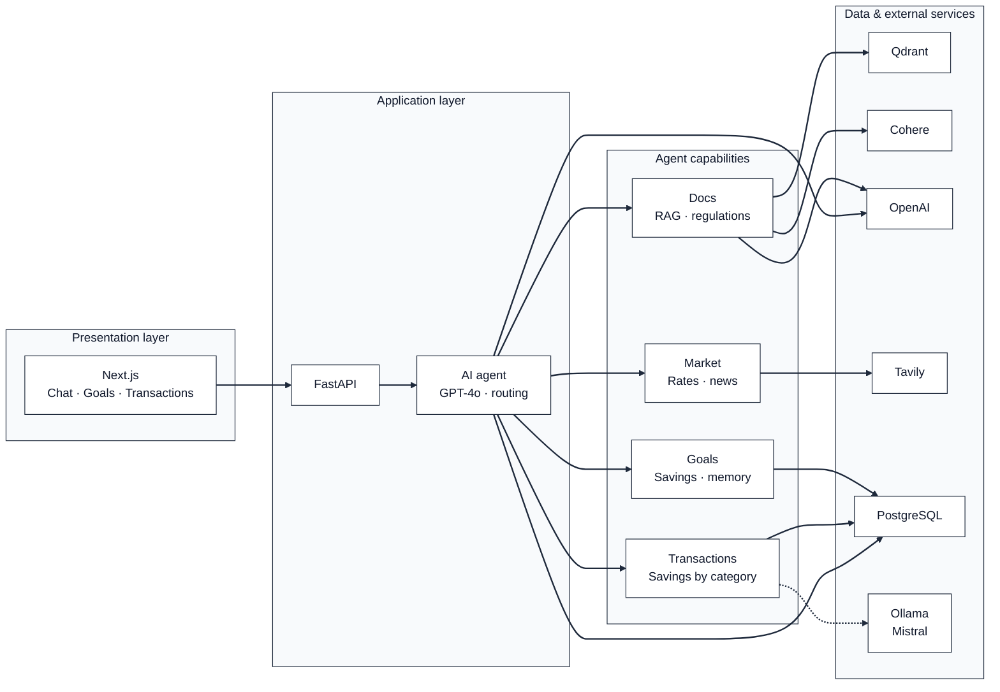

# Certification Deliverables — BaniWise (AIE9)

All certification deliverables for Tasks 1–7, as required by the [Certification Challenge](https://absorbing-toaster-713.notion.site/The-Certification-Challenge-2e7cd547af3d807996d6ea1e0ec931df).

---

## Task 1: Defining Problem, Audience, and Scope

### Problem Statement

Romanian retail investors lack an accessible, intelligent assistant that can help them navigate the country's complex financial landscape — from government bond programs (TEZAUR, FIDELIS) to BVB-listed instruments, mutual funds, and savings planning — while staying compliant with MiFID II regulations.

### Why This Is a Problem

Romania has a low financial literacy rate compared to the EU average, and existing resources are scattered across government websites (mfinante.ro), regulatory bodies (ASF), and the Bucharest Stock Exchange (BVB). Most documentation is dense, regulatory-style PDF content that everyday investors struggle to parse. A first-time investor asking "What is TEZAUR and should I invest?" must piece together information from multiple sources, compare it against bank deposit rates, and understand tax implications — all without personalized guidance.

Additionally, there is no Romanian-language AI financial assistant that combines document knowledge (regulations, product specs) with live market data (exchange rates, current bond emissions) and personal financial goal tracking. Existing chatbots are either generic (ChatGPT doesn't know FIDELIS details) or bank-specific (limited to one institution's products). BaniWise bridges this gap by providing a single, intelligent assistant that understands Romanian financial instruments, speaks the user's language, and helps them plan toward concrete savings goals.

### Evaluation Questions (Input–Output Pairs)

| # | Question (Input) | Expected Output |
|---|---|---|
| 1 | Ce sunt titlurile de stat TEZAUR? *(EN: "What are TEZAUR government bonds?")* | Explains that TEZAUR bonds are issued by the Ministry of Finance, available to individuals, tax-exempt, with 1/3/5 year maturities, 100% state-guaranteed. |
| 2 | Care sunt diferențele între TEZAUR și FIDELIS? *(EN: "What are the differences between TEZAUR and FIDELIS?")* | TEZAUR is not exchange-traded and is tax-exempt; FIDELIS is listed on BVB, tradeable on secondary market, and taxed at 10%. |
| 3 | Ce avantaje are TEZAUR față de depozitele bancare? *(EN: "What advantages does TEZAUR have over bank deposits?")* | No capital loss risk, higher interest than bank deposits, tax-free income, accessible from 1 RON. |
| 4 | Cum se pot achiziționa titlurile FIDELIS? *(EN: "How can FIDELIS bonds be purchased?")* | FIDELIS is listed on BVB and can be bought via the secondary market through any authorized broker. |
| 5 | Care este cursul EUR/RON astăzi? *(EN: "What is the EUR/RON exchange rate today?")* | Retrieves live exchange rate via Tavily (market search tool). |
| 6 | Vreau să creez un obiectiv de 50000 RON pentru mașină *(EN: "I want to create a 50,000 RON goal for a car")* | Creates a financial goal via the goals tool. |
| 7 | What are the main differences between TEZAUR and FIDELIS? | Same as Q2, but responds in English (language auto-detection). |

---

## Task 2: Proposed Solution

### UX and Tools

BaniWise is a conversational financial assistant deployed as a web application. The frontend is a clean chat-first interface (Next.js 14) with a sidebar for navigation. Users ask questions in natural language (Romanian or English) and the agent draws on its document knowledge base, live web search, the user's personal savings goals, and **anonymized transaction insights** to provide contextually rich answers. A dedicated "Goals" tab allows users to create and track savings targets visually with progress bars and feasibility indicators. A **Transactions** tab lets users upload CSV bank statements (BRD, BCR, Raiffeisen, ING); the backend parses, categorizes (Mistral via Ollama or rule-based fallback), and anonymizes transactions, then the agent can use the `savings_insights` tool to suggest where to save based on spending by **detailed categories** (fees, shopping, transport, health, groceries, etc.). **Transaction import is processed by a local model (Mistral via Ollama)** — raw transaction data is never sent to OpenAI or other cloud AI providers; only anonymized category-level aggregates reach the agent. The agent includes automatic MiFID II disclaimers whenever investment products are discussed, and cites sources inline with page numbers.

### Architecture Diagram

High-level view of the system in three layers: what the user sees, where the logic runs, and where data and external services live.



See [README.md](../README.md#-architecture) for detailed technical diagrams of the RAG pipeline, memory, and tool routing.

### Technology Rationale

| Component | Choice | Rationale |
|---|---|---|
| **LLM** | OpenAI GPT-4o | Best multilingual reasoning for Romanian financial domain; supports tool calling natively for the Supervisor pattern. |
| **Agent Orchestration** | LangChain + LangGraph | Provides the `StateGraph` and `create_react_agent` abstractions needed for the Supervisor pattern with checkpointed state — directly aligned with AIE9 Sessions 4–6. |
| **Tools** | `rag_query`, `market_search`, `goals_summary`, `create_goal`, `savings_insights` | Maps the financial domain to five capabilities: static knowledge, live data, goal reading, goal creation, and transaction-based savings insights — each routed by the Supervisor. |
| **Transaction categorization** | Mistral (Ollama) + rule-based fallback | Runs locally; raw transaction data is never shared with OpenAI or other AI providers. Detailed categories: fees (account, ATM, transfer, card, overdraft, interest, FX, other), shopping (electronics, clothing, home/garden, beauty, other), transport (fuel, public, taxi, parking/tolls, car maintenance, other), health (pharmacy, doctor/clinic, dental, optics, insurance, other). Same set used by LLM and rules; only anonymized category-level aggregates reach the agent. |
| **Embedding Model** | OpenAI `text-embedding-3-small` | Cost-effective, high-quality embeddings with 1536 dimensions; consistent with the RAG pipeline from AIE9 Session 2. |
| **Vector Database** | Qdrant | Purpose-built for vector similarity search with filtering; runs containerized via Docker Compose for easy local deployment. |
| **Monitoring** | LangSmith | Enables end-to-end tracing of agent runs, tool invocations, and LLM calls; directly integrated via LangChain's tracing configuration. |
| **Evaluation** | RAGAS | Industry-standard framework for RAG evaluation (Faithfulness, Context Precision, Context Recall, Answer Relevancy); used in AIE9 Sessions 9–10. |
| **UI** | Next.js 14 (App Router) + TypeScript + TailwindCSS | Production-grade React framework with SSR, streaming support for SSE chat, and a component-based architecture. |
| **Deployment** | Docker Compose | Orchestrates all 4 services (backend, frontend, PostgreSQL, Qdrant) with a single `docker compose up` command. |

### RAG and Agent Components (Exactly)

**RAG components:** (1) **Document store** — Romanian financial PDFs in `backend/documents/`, loaded via PyMuPDF. (2) **Chunking** — ParentDocumentRetriever with RecursiveCharacterTextSplitter (parent 2000 chars, child 400 chars). (3) **Embeddings** — OpenAI `text-embedding-3-small`. (4) **Vector store** — Qdrant; child chunks are embedded and stored there; parent chunks live in an in-memory docstore (persisted as `docstore.pkl`). (5) **Retrievers** — ParentDocumentRetriever (small-to-big), BM25Retriever (sparse), EnsembleRetriever (BM25 + vector, 0.2/0.8), CohereRerank (`rerank-multilingual-v3.0`, applied as a post-retrieval compression step). (6) **RAG tool** — The `rag_query` tool calls this pipeline and returns formatted context to the LLM.

**Agent components:** (1) **Orchestrator** — LangGraph Supervisor (GPT-4o, `create_react_agent`), which decides which tools to call. (2) **Tools** — `rag_query` (document search), `market_search` (Tavily for rates/news), `goals_summary` (read user goals from PostgreSQL), `create_goal` (create savings goals), `savings_insights` (anonymized transaction analysis by category). (3) **Memory** — CoALA-style: short-term (AsyncPostgresSaver per thread), long-term (AsyncPostgresStore profile), semantic (AsyncPostgresStore knowledge); rolling summarization when history exceeds 100 messages. (4) **Routing** — The Supervisor inspects the user message and invokes one or more tools; results are passed back into the graph for the final answer.

---

## Task 3: Dealing with the Data

### Data Sources

**Local document knowledge base** — 13 Romanian financial PDFs in `backend/documents/` (mounted at `/app/documents` in Docker). The RAG pipeline ingests these via the `/api/documents/ingest` endpoint (PyMuPDF loader, then ParentDocumentRetriever into Qdrant and an in-memory docstore persisted to `docstore.pkl` in the documents folder):

| Document | Content |
|---|---|
| `Ghid_TEZAUR_si_FIDELIS.pdf` | TEZAUR and FIDELIS combined guide |
| `ghidul_investitorului.pdf` | Investor guide |
| `ghid_investitor_asf.pdf` | ASF investor guide |
| `ghid_piata_capital_asf.pdf` | ASF capital market guide |
| `ghid_investitor_titluri_stat_ue_2019.pdf` | EU state securities investor guide (2019) |
| `legea_126_2018_piata_capital.pdf` | Law 126/2018 (capital market / MiFID II) |
| `legea_24_2017_emitenti.pdf` | Law 24/2017 (issuers) |
| `cod_bvb_operator_2022.pdf` | BVB operator code (2022) |
| `cod_can_ats_2010.pdf` | CAN/ATS code (2010) |
| `codul_fiscal_2026.pdf` | Fiscal code (2026) |
| `info_preinvestitie_fonduri_mutuale_unicredit.pdf` | Mutual funds pre-investment info (UniCredit) |
| `kid_etf_bet_brk_2026.pdf` | ETF KID BET BRK (2026) |
| `termeni_conditii_ordine_unitati_fond.pdf` | Fund unit order terms and conditions |

**External API** — [Tavily Search API](https://tavily.com) is used by the `market_search` tool for real-time financial data: exchange rates (e.g. EUR/RON), BVB-related prices, current bond emissions (TEZAUR/FIDELIS), and financial news.

**How they interact:** The Supervisor routes each query to the right source. _How products work, regulations, definitions_ → `rag_query` (document search over the PDFs above). _Current prices, live data, news_ → `market_search` (Tavily). The agent can call both in one turn when needed (e.g. “Is FIDELIS available today and how does it work?”).

### Chunking Strategy

We use a **Parent/Child chunking strategy** (small-to-big retrieval) via LangChain's `ParentDocumentRetriever`:

- **Parent chunks**: `RecursiveCharacterTextSplitter` with `chunk_size=2000`, `chunk_overlap=200` — these are the full-context chunks returned to the LLM for answer generation.
- **Child chunks**: `RecursiveCharacterTextSplitter` with `chunk_size=400`, `chunk_overlap=50` — smaller, focused chunks used for embedding and similarity search in Qdrant.

**Rationale:** Small child chunks produce more precise vector matches (less noise), while the parent chunks ensure the LLM has enough surrounding context to generate faithful, comprehensive answers. This two-stage approach is especially important for dense regulatory documents where a single sentence's meaning depends on the surrounding paragraphs. The `RecursiveCharacterTextSplitter` respects natural boundaries (paragraphs, sentences) rather than splitting mid-word.

---

## Task 4: Building an End-to-End Agentic RAG Prototype

### Deployment

The prototype runs locally via Docker Compose:

```bash
# Start all services
docker compose up --build

# Endpoints:
#   http://localhost:3000  → Next.js Frontend
#   http://localhost:8000  → FastAPI Backend (Swagger at /docs)
```

### Architecture Highlights

**Supervisor Agent (LangGraph `create_react_agent`):**
- Model: GPT-4o with `temperature=0.3`
- 5 tools: `rag_query`, `market_search`, `goals_summary`, `create_goal`, `savings_insights`
- Automatic language detection and response matching (RO/EN)
- MiFID II disclaimers injected automatically for investment-related queries

**CoALA Memory Architecture** (3 of 5 types from the CoALA framework):
- **Short-term memory**: `AsyncPostgresSaver` checkpointer — maintains conversation context per `thread_id`
- **Long-term memory**: `AsyncPostgresStore` namespace `(user_id, "profile")` — persistent user preferences
- **Semantic memory**: `AsyncPostgresStore` namespace `(user_id, "knowledge")` — learned financial facts extracted from conversations
- **Rolling summarization**: When conversation exceeds 100 messages, older messages are summarized by GPT-4o-mini and the summary is stored in `(user_id, "summary", session_id)`, maintaining context without token overflow

**Streaming:** Server-Sent Events (SSE) with tool-use status messages ("Searching financial documents…", "Loading your goals…") for real-time UX feedback.

---

## Task 5: Evaluations (RAGAS Baseline)

### Golden Data Set

Five curated question–answer pairs focusing on Romanian government bonds (TEZAUR/FIDELIS), sourced from the document knowledge base:

| # | Question | Ground Truth (Summary) |
|---|---|---|
| 1 | Ce sunt titlurile de stat TEZAUR? *(EN: "What are TEZAUR government bonds?")* | Ministry of Finance instruments for individuals, 1/3/5 year maturities, fixed rate, 100% state-guaranteed, tax-exempt. |
| 2 | Care sunt diferențele între TEZAUR și FIDELIS? *(EN: "What are the differences between TEZAUR and FIDELIS?")* | TEZAUR: not exchange-traded, tax-exempt, early redemption with penalty. FIDELIS: BVB-listed, tradeable, taxed at 10%. |
| 3 | Ce avantaje are TEZAUR față de depozitele bancare? *(EN: "What advantages does TEZAUR have over bank deposits?")* | No capital loss risk, higher rates, tax-free, accessible from 1 RON. |
| 4 | Cum se pot achiziționa titlurile FIDELIS? *(EN: "How can FIDELIS bonds be purchased?")* | Listed on BVB, bought via secondary market, fixed semi-annual coupon. |
| 5 | Ce maturități au titlurile de stat românești? *(EN: "What maturities do Romanian government bonds have?")* | 1, 3, or 5 years. FIDELIS available in RON or EUR. |

Additionally, the SDG notebook (`backend/notebooks/sdg_and_evaluation.ipynb`) uses RAGAS `TestsetGenerator` to programmatically generate Simple, Multi-Context, and Reasoning questions from the raw PDFs.

### RAGAS Metrics Evaluated

- **Faithfulness** — How factually consistent is the answer with the provided context?
- **Answer Relevancy** — How relevant is the generated answer to the question?
- **Context Precision** — Are the retrieved chunks relevant and ranked well?
- **Context Recall** — Are all necessary pieces of information retrieved?

### Evaluation Implementation

The evaluation runs via the Jupyter notebook `backend/notebooks/sdg_and_evaluation.ipynb`, which:
1. Loads three target PDFs (`Ghid_TEZAUR_si_FIDELIS.pdf`, `ghid_investitor_titluri_stat_ue_2019.pdf`, `termeni_conditii_ordine_unitati_fond.pdf`) for SDG — the largest document (`codul_fiscal_2026.pdf`, ~1,550 pages) was excluded from SDG to stay within API rate limits, but remains fully indexed in the RAG pipeline for retrieval and evaluation
2. Uses RAGAS `TestsetGenerator` (GPT-4.1-nano) to generate 12 synthetic evaluation questions
3. Appends 5 manually curated cross-document questions (including Fiscal Code references) for a total of 17 evaluation questions
4. Runs the RAG pipeline in three tiers — generating answers with **GPT-4o** (matching the production agent model) — and evaluates each with RAGAS metrics (scored by **GPT-4.1-mini**)

> **Note on document coverage:** SDG was run on 3 of 13 indexed PDFs (44 pages, 129 chunks) due to OpenAI rate limits on the free tier. However, the RAG pipeline retrieves from the **full 13-document corpus** (all documents indexed in Qdrant), and the 5 manual test questions explicitly test cross-document reasoning across TEZAUR/FIDELIS guides, fund terms, and the Fiscal Code. The evaluation therefore reflects real-world retrieval performance across the complete knowledge base.

### Baseline Results (Tier 1: Dense Vector Only)

| Metric | Score |
|---|---|
| **Faithfulness** | 0.8533 |
| **Answer Relevancy** | 0.7374 |
| **Context Precision** | 0.4596 |
| **Context Recall** | 0.7686 |

> **Evaluator note:** These scores use GPT-4o for answer generation (matching the production agent) and GPT-4.1-mini as the RAGAS evaluator. The answer generation prompt instructs GPT-4o to ground answers in the retrieved context while fully addressing the question — balancing faithfulness with answer completeness. A stronger evaluator model produces stricter, more realistic scores than smaller models — particularly on context precision and recall, where it applies tighter relevance thresholds.

### Conclusions

The baseline dense vector retriever (ParentDocumentRetriever only, no BM25 fusion or reranking) achieves good faithfulness (0.85) and answer relevancy (0.74), but **context precision is low at 0.46**, meaning over half of retrieved chunks are noise. Context recall (0.77) shows the retriever misses some relevant information. These are the primary targets for Task 6.

---

## Task 6: Improving the Prototype

### Advanced Retrieval Techniques

We implemented **four** complementary retrieval improvements over the naive top-K baseline:

| Technique | Purpose | Implementation |
|---|---|---|
| **ParentDocumentRetriever** | Small-to-big retrieval: search on small chunks, return larger context | `langchain.retrievers.ParentDocumentRetriever` with child (400 chars) for search, parent (2000 chars) for context |
| **BM25Retriever** | Sparse keyword matching for exact term hits (e.g., "TEZAUR", "MiFID II") | `langchain_community.retrievers.BM25Retriever` built from parent-split documents |
| **EnsembleRetriever** | Combine dense (vector) and sparse (BM25) retrieval with weighted fusion | `langchain.retrievers.EnsembleRetriever` with weights `[0.2, 0.8]` (20% BM25, 80% vector) |
| **CohereRerank** | Contextual compression: rerank top-K results to select the most relevant top-N | `langchain_cohere.CohereRerank` using `rerank-multilingual-v3.0`, top_n=12 (from top_k=20 candidates) |

**Rationale:** Each technique addresses a different retrieval weakness:
- **ParentDocumentRetriever** solves the context fragmentation problem — small chunks match better but lose context.
- **BM25** catches exact keyword matches that embedding-based retrieval can miss (important for Romanian financial acronyms like "BVB", "ASF", "FIDELIS").
- **EnsembleRetriever** fuses the strengths of both sparse and dense retrieval.
- **CohereRerank** is the final quality gate — a cross-encoder that understands query-document relevance better than cosine similarity.

### RAGAS Three-Tier Comparison

The evaluation notebook runs all three pipelines on the same 17-question dataset (12 SDG + 5 manual) and produces a side-by-side comparison:

| Metric | Tier 1: Dense Vector | Tier 2: Hybrid Ensemble | Tier 3: Hybrid+Rerank | Delta (T3 vs T1) |
|---|---|---|---|---|
| **Faithfulness** | 0.8533 | **0.9069** | 0.8612 | **+0.0079** ✅ |
| **Answer Relevancy** | 0.7374 | **0.7447** | 0.6904 | -0.0470 ❌ |
| **Context Precision** | 0.4596 | 0.4436 | **0.5077** | **+0.0481** ✅ |
| **Context Recall** | 0.7686 | **0.8127** | 0.7980 | **+0.0294** ✅ |

**Key findings:**

1. **Tier 3 improves 3 of 4 metrics over the baseline.** Faithfulness (+0.008), context precision (+0.05), and context recall (+0.03) all improve with the full Hybrid+Rerank pipeline. The reranker filters noise from the ensemble's candidates while the wider retrieval window (top_k=20, top_n=12) preserves enough context for faithful answer generation.

2. **The hybrid ensemble (Tier 2) delivers the best faithfulness and context recall** (0.91 and 0.81 respectively). BM25's keyword matching captures relevant chunks that embedding similarity misses — particularly for Romanian financial acronyms ("BVB", "ASF", "FIDELIS"). Reranking (Tier 3) then trades a small amount of recall for the best context precision.

3. **Answer relevancy is the one trade-off** (0.74 → 0.69 for Tier 3). The reranker's more focused context window produces more precise but slightly narrower answers. For a financial assistant where factual accuracy and regulatory compliance matter more than broad coverage in a single response, this is an acceptable trade-off — users can always ask follow-up questions for additional detail.

4. **The stricter evaluator produces lower absolute scores** compared to prior runs with smaller evaluator models. Context precision (0.44–0.51) and recall (0.77–0.81) reflect the evaluator's tighter definition of "relevant context" — a more conservative but realistic assessment.

> To reproduce: `docker compose exec backend jupyter notebook --ip=0.0.0.0 --port=8888 --no-browser --allow-root --NotebookApp.token='' --notebook-dir=/app`, then open http://localhost:8888 → `notebooks/sdg_and_evaluation.ipynb` → Kernel → Restart & Run All.

---

## Task 7: Next Steps — Decision for Demo Day

### Decision: **Keep the Tier 3 Cohere-Reranked Hybrid Ensemble** ✅

We will use the Tier 3 pipeline (ParentDocumentRetriever + BM25 + EnsembleRetriever + CohereRerank) for Demo Day.

**Rationale:**
1. The three-tier RAGAS evaluation on 17 questions (12 SDG + 5 manual) shows that **Tier 3 improves 3 of 4 metrics over the baseline**: faithfulness (+0.008), context precision (+0.05), and context recall (+0.03). The reranker effectively filters noise from the ensemble's candidates while the wider retrieval window (top_k=20 → top_n=12) preserves enough context for faithful, grounded answers.
2. The hybrid ensemble (Tier 2) improves context recall (+0.04 over baseline) by combining BM25 keyword matching with vector similarity. Reranking (Tier 3) then refines these results for precision — the metric most directly tied to answer quality.
3. Cohere's `rerank-multilingual-v3.0` cross-encoder is specifically designed for non-English content, making it ideal for our Romanian financial documents where cosine similarity alone misses nuanced relevance.
4. The only trade-off is answer relevancy (0.74 → 0.69). The reranker's more focused context window produces more precise but slightly narrower answers. For a financial assistant where factual accuracy and regulatory compliance matter more than broad coverage in a single response, this is acceptable — users can ask follow-up questions.
5. The added latency (200–500ms for reranking) and cost ($0.001 per query) are negligible for a chat-based UX where users are already waiting for GPT-4o streaming.
6. Agent evaluation confirms **100% tool routing accuracy and 100% MiFID II compliance** across all 6 scenarios, with an average answer quality of 4.3/5 (GPT-4.1 judge).

**Future improvements** (beyond Demo Day):
- **Multi-query retrieval** (AIE9 Session 11) — generate multiple phrasings of the user's question to improve context recall, especially where colloquial Romanian queries miss chunks written in formal/legal terminology. This is a retrieval-time improvement that stacks on top of the existing Ensemble+Rerank pipeline without re-ingestion.
- Fine-tuning ensemble weights (currently 0.2/0.8 BM25/vector) based on per-query-type analysis, and moving DocStore and BM25 to PostgreSQL for multi-worker scaling.

---

## Agent Evaluation (Bonus)

Beyond RAG evaluation, the notebook tests the full Supervisor agent across **6 scenarios** covering all 5 tools plus an off-topic guardrail. Scoring uses a weighted rubric: Tool Call Accuracy (35%), LLM-as-Judge Answer Quality (35%), and MiFID II Compliance (30%).

| # | Category | Tool Correct | Quality | Disclaimer | Overall |
|---|---|---|---|---|---|
| 1 | RAG Query (RO) — "Ce este TEZAUR?" *(EN: "What is TEZAUR?")* | ✅ `rag_query` | 4/5 | ✅ | **0.91** |
| 2 | Market Search — "Cursul EUR/RON astazi?" *(EN: "EUR/RON rate today?")* | ✅ `market_search` | 4/5 | ✅ | **0.91** |
| 3 | Goals Query — "Obiectivele mele financiare?" *(EN: "My financial goals?")* | ✅ `goals_summary` | 4/5 | ✅ | **0.91** |
| 4 | Create Goal — "Creează obiectiv 10000 RON laptop" *(EN: "Create a 10,000 RON goal for a laptop")* | ✅ `create_goal` | 5/5 | ✅ | **1.00** |
| 5 | RAG Query (EN) — "Differences TEZAUR vs FIDELIS?" | ✅ `rag_query` | 5/5 | ✅ | **1.00** |
| 6 | Off-Topic Guardrail — "Rețeta de sarmale?" *(EN: "Recipe for stuffed cabbage rolls?")* | ✅ none | 4/5 | ✅ | **0.91** |

**Summary:**
- **Pass Rate: 6/6 (100%)** at the 0.70 threshold
- **Tool Call Accuracy: 6/6 (100%)** — Supervisor correctly routes every scenario
- **Avg Answer Quality: 4.3/5** (LLM-as-judge, GPT-4.1)
- **MiFID II Compliance: 6/6 (100%)** — disclaimers present when required, absent when not

The evaluation validates:
- **Tool Routing** — Supervisor correctly routes to `rag_query`, `market_search`, `goals_summary`, `create_goal`, and refuses off-topic queries
- **Answer Quality** — LLM-as-judge (GPT-4.1) provides nuanced scoring with per-scenario rubrics (replacing brittle keyword matching)
- **MiFID II Compliance** — Regulatory disclaimers present for all investment-related answers
- **Language Detection** — Agent responds in English when prompted in English (Scenario 5 scores 5/5 with the GPT-4.1 judge, which correctly recognizes the comprehensive coverage of TEZAUR vs FIDELIS differences)

---

## Submission Artifacts

| Artifact | Location |
|---|---|
| Source Code | This GitHub repository |
| Written Deliverables | This file (`CERTIFICATION_DELIVERABLES.md`) |
| Architecture Diagrams | [README.md](../README.md#-architecture) (Mermaid) |
| SDG + RAG + Agent Evaluation | [sdg_and_evaluation.ipynb](../backend/notebooks/sdg_and_evaluation.ipynb) |
| Loom Video | *(link to be added)* |
