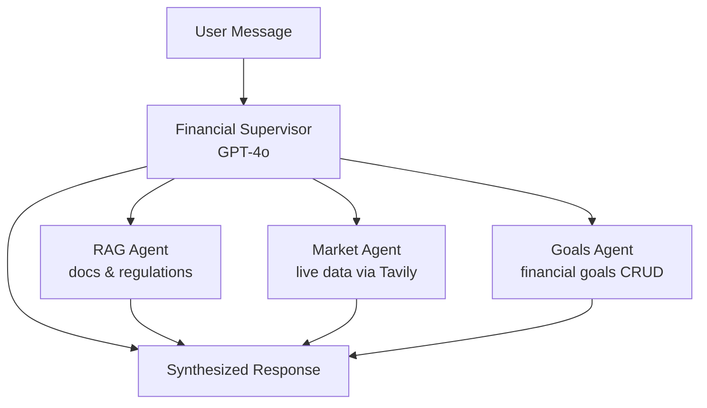

# Personal Financial Agent — Certification Demo App

A **Personal Financial Agent AI** for Romanian investors, built as a certification demo for the AI Engineering Bootcamp (AIE9). The app demonstrates mastery of **RAG**, **Agents**, **Evaluations**, and **Synthetic Data Generation** using the course's technology stack. The financial domain (Romanian regulations, BVB, TEZAUR/FIDELIS, goals tracking) provides a rich, real-world context.

## User Review Required

> [!IMPORTANT]
> **Agent Architecture Decision**: I recommend the **Supervisor pattern** for this app, because:
> - It maps naturally to the financial domain: a central `FinancialSupervisor` routes to specialist capabilities (RAG docs, market search, goals management)
> - It demonstrates multi-agent knowledge from Session 5
> - It's more impressive for certification than a simple ReAct agent with tools
> - Sub-agents can have specialized system prompts (e.g., the RAG agent adds MiFID II disclaimers, the goals agent does calculations)

> [!WARNING]
> **Next.js + FastAPI** is NOT from the course. The certification primarily evaluates the AI/ML pipeline (RAG, agents, evals, SDG). The frontend is your value-add but could raise questions about whether you built it vs. generated it. Keep it clean but simple—focus energy on the AI pipeline.

---

## Coding Standards

### Python Backend (AIE9-Aligned Style)

The backend follows the patterns from the AIE9 codebase (`wellness_memory/agents.py`, `aimakerspace/` library):

**Structure:**
- One class per concern (e.g., `RAGService`, `GoalsService`, `FinancialSupervisor`)
- Module-level docstrings explaining purpose
- `__init__` with dependency injection (services receive their dependencies)
- Factory functions for graph creation (e.g., `create_financial_agent()`)
- `if __name__ == "__main__"` blocks for quick testing

**Typing & Docs:**
- Full type hints on all functions and methods (params + return types)
- `TypedDict` for LangGraph state definitions (like `WellnessState` in Session 6)
- Docstrings on every class and public function (Google style: description, Args, Returns)
- `Annotated` types for LangGraph message lists

**LangGraph patterns (from Sessions 4-6):**
```python
# State as TypedDict
class FinancialState(TypedDict):
    messages: Annotated[list[BaseMessage], add_messages]
    user_id: str

# Nodes as functions with (state, config, *, store) signature
def rag_agent_node(state, config, *, store):
    ...

# Graph built via StateGraph → add_node → add_edge → compile
builder = StateGraph(FinancialState)
builder.add_node("supervisor", supervisor_node)
graph = builder.compile(checkpointer=checkpointer, store=store)
```

**Other conventions:**
- `async` / `await` for I/O operations (DB, API calls, embeddings)
- Pydantic models for API request/response schemas
- Environment config via Pydantic `Settings` with `.env` file
- Error handling with specific exception types + logging
- Constants defined at module level (CATEGORIES, SYSTEM_PROMPT, etc.)

### Next.js Frontend

- TypeScript strict mode
- Server Components by default, `"use client"` only where needed (interactivity)
- `fetch` calls to backend API in dedicated `lib/api.ts` module
- Tailwind CSS utility classes, no inline styles
- Components in `components/` with PascalCase naming
- Pages in `app/` using App Router conventions
- Zod schemas for form validation (mirrors Pydantic on backend)

## Technology Stack (Course-Aligned + Your Choices)

| Layer | Technology | Source |
|---|---|---|
| LLM (cloud) | OpenAI GPT-4o (supervisor) + GPT-4o-mini (specialists) | AIE9 Sessions 4-7 |
| LLM (local) | Ollama `llama3.2:3b` (transaction categorization + anonymization) | AIE9 Session 4 |
| Orchestration | LangChain + LangGraph (`StateGraph`, Supervisor) | AIE9 Sessions 4-6 |
| Vector DB | Qdrant (Docker, `langchain-qdrant`) | AIE9 Sessions 4-5 |
| Embeddings | OpenAI `text-embedding-3-small` | AIE9 Session 2 |
| Search | Tavily API | AIE9 Session 5 |
| Reranking | Cohere (`langchain-cohere`) | AIE9 Session 10 |
| Memory | LangGraph memory (short-term `MemorySaver` + long-term `InMemoryStore`) | AIE9 Session 6 |
| Evaluation | RAGAS 0.2.10 + LangSmith | AIE9 Sessions 9-10 |
| SDG | RAGAS synthetic data generation | AIE9 Session 9 |
| Tracing | LangSmith | AIE9 Sessions 5-10 |
| Backend API | FastAPI (Python 3.11+) | User choice |
| Frontend | Next.js 14 (App Router) + TypeScript + Tailwind | User choice |
| Database | PostgreSQL 16 (Docker) | User choice |
| Deployment | Docker Compose | User choice |

---

## Project Structure

```
financial-agent/
├── backend/
│   ├── app/
│   │   ├── main.py                    # FastAPI app + create_all() on startup
│   │   ├── config.py                  # Pydantic Settings from .env
│   │   ├── database.py                # SQLAlchemy async engine + session
│   │   ├── models/
│   │   │   ├── goal.py                # SQLAlchemy Goal model
│   │   │   └── user.py                # SQLAlchemy User model
│   │   ├── api/
│   │   │   ├── users.py               # POST /api/users (simple identity)
│   │   │   ├── chat.py                # POST /api/chat (streaming)
│   │   │   ├── goals.py               # CRUD /api/goals
│   │   │   └── documents.py           # POST /api/documents/ingest
│   │   └── services/
│   │       ├── rag_service.py          # RAG pipeline (ingest + query)
│   │       ├── agent_service.py        # LangGraph Supervisor agent
│   │       └── goals_service.py        # Goals business logic
│   ├── documents/                      # Romanian financial PDFs (manually added)
│   ├── evals/
│   │   ├── sdg_and_evaluation.ipynb     # PRIMARY: Jupyter notebook for certification demo
│   │   ├── eval_rag.py                 # OPTIONAL: Programmatic RAG evaluation script
│   │   └── eval_agent.py              # OPTIONAL: Programmatic agent evaluation script
│   ├── seed_demo_data.py               # Pre-load demo goals + sample user
│   ├── requirements.txt
│   └── Dockerfile
├── frontend/                           # Built last (Phase 8)
│   ├── app/
│   │   ├── layout.tsx
│   │   ├── page.tsx                    # → redirects to /chat
│   │   ├── chat/page.tsx               # Chat interface
│   │   └── goals/page.tsx              # Goals CRUD
│   ├── components/
│   │   ├── ChatWindow.tsx
│   │   ├── GoalCard.tsx
│   │   └── GoalForm.tsx
│   ├── package.json
│   └── Dockerfile
├── docker-compose.yml
├── .env.example
└── README.md
```

---

## Proposed Changes

### 1. Infrastructure — Docker Compose + Config

#### [NEW] [docker-compose.yml](file:///Users/adrianbarcan/Projects/CertificationChallenge/docker-compose.yml)
Services: `backend` (FastAPI on :8000), `frontend` (Next.js on :3000), `postgres` (PostgreSQL 16 on :5432), `qdrant` (Qdrant on :6333), `ollama` (Ollama on :11434, Phase 2). Volumes for persistent data.

#### [NEW] [.env.example](file:///Users/adrianbarcan/Projects/CertificationChallenge/.env.example)
Keys: `OPENAI_API_KEY`, `TAVILY_API_KEY`, `COHERE_API_KEY`, `LANGSMITH_API_KEY`, `POSTGRES_*`, `QDRANT_*`.

#### [NEW] [config.py](file:///Users/adrianbarcan/Projects/CertificationChallenge/backend/app/config.py)
Pydantic `Settings` class loading from `.env`. Covers all API keys, DB connections, RAG params (chunk size, overlap, collection name, top_k).

---

### 2. RAG Pipeline — `rag_service.py`

#### [NEW] [rag_service.py](file:///Users/adrianbarcan/Projects/CertificationChallenge/backend/app/services/rag_service.py)

Direct adaptation of **AIE9 Sessions 2 + 4 + 10** patterns:

- **Document loading**: `PyMuPDFLoader` for PDFs from `/documents` folder (from Session 10's `pymupdf` dependency)
- **Documents**: Manually sourced Romanian financial PDFs (BVB investor guide, TEZAUR/FIDELIS docs, ASF regulations, MiFID II summary). Placed in `backend/documents/` before ingestion.
- **Chunking**: `RecursiveCharacterTextSplitter` with `chunk_size=512`, `chunk_overlap=64` (from Session 4)
- **Embeddings**: `OpenAIEmbeddings(model="text-embedding-3-small")` (from Session 2)
- **Vector store**: `QdrantVectorStore` with collection `"financial_docs_ro"` (from Sessions 4-5)
- **Retrieval**: Top-5 similarity search → **Cohere reranking** (`CohereRerank`) → Top-3 final (from Session 10)
- **Context assembly**: Concatenate retrieved chunks into a formatted context string

```python
class RAGService:
    async def ingest_documents(self, folder_path: str) -> dict
    async def query(self, question: str, top_k: int = 5) -> list[Document]
    async def get_context_for_prompt(self, question: str) -> str
```

---

### 3. Agent Service — LangGraph Supervisor

#### [NEW] [agent_service.py](file:///Users/adrianbarcan/Projects/CertificationChallenge/backend/app/services/agent_service.py)

**Architecture: Supervisor Pattern** (from AIE9 Session 5)



- **Supervisor** (GPT-4o): Central orchestrator using `langgraph` `StateGraph`. Decides which sub-agent(s) to invoke based on the user query. Uses the `create_react_agent` or custom supervisor node from Session 5.
- **RAG Sub-agent**: Queries `rag_service` for Romanian financial docs. Adds MiFID II disclaimer when discussing investment products.
- **Market Sub-agent**: Uses Tavily search for live data (BVB quotes, BNR exchange rates, financial news).
- **Goals Sub-agent**: Interfaces with `goals_service` to read/create/update goals. Provides feasibility analysis.

**Memory** (from AIE9 Session 6 — 3 of 5 CoALA memory types):
- **Short-term**: `MemorySaver` checkpointer with `thread_id` for conversation context
- **Long-term**: `InMemoryStore` with namespace `(user_id, "profile")` for persistent user preferences (name, risk tolerance, investment interests)
- **Semantic**: `InMemoryStore` with namespace `(user_id, "knowledge")` + embedding-based search. Stores financial facts learned during conversations (e.g., "user is interested in ETFs", "user has a mortgage"). Retrieved by similarity to new queries, providing personalized context.

**System prompt**: Romanian financial assistant persona, MiFID II compliance, source citation, **responds in the user's language** (Romanian or English — auto-detected from message).

---

### 4. Goals Service + Database

#### [NEW] [database.py](file:///Users/adrianbarcan/Projects/CertificationChallenge/backend/app/database.py)
SQLAlchemy async engine + session factory connecting to PostgreSQL. Tables created via `Base.metadata.create_all()` on app startup (no Alembic — appropriate for demo).

#### [NEW] [goal.py](file:///Users/adrianbarcan/Projects/CertificationChallenge/backend/app/models/goal.py)
SQLAlchemy model: `Goal(id, user_id, name, icon, target_amount, saved_amount, monthly_contribution, deadline, priority, status, notes, created_at, updated_at)`.

#### [NEW] [goals_service.py](file:///Users/adrianbarcan/Projects/CertificationChallenge/backend/app/services/goals_service.py)
- CRUD operations
- `calculate_months_to_goal()`, `calculate_required_monthly()`, `check_goal_feasibility()`
- These become tools available to the Goals sub-agent

---

### 5. API Layer

#### [NEW] [main.py](file:///Users/adrianbarcan/Projects/CertificationChallenge/backend/app/main.py)
FastAPI app with CORS, lifespan (init DB, init RAG on startup).

#### [NEW] [users.py](file:///Users/adrianbarcan/Projects/CertificationChallenge/backend/app/api/users.py)
- `POST /api/users` — Create user with just a `name`. Returns `user_id` (UUID). Frontend stores this in `localStorage`.
- `GET /api/users/{id}` — Get user profile
- No passwords, no tokens — simple identity for demo purposes

#### [NEW] [chat.py](file:///Users/adrianbarcan/Projects/CertificationChallenge/backend/app/api/chat.py)
- `POST /api/chat` — Accepts `{message, session_id}`, returns streaming response via `StreamingResponse`
- `GET /api/chat/history/{session_id}` — Conversation history from LangGraph checkpointer

#### [NEW] [goals.py](file:///Users/adrianbarcan/Projects/CertificationChallenge/backend/app/api/goals.py)
- Full CRUD: `GET/POST /api/goals`, `PUT/DELETE /api/goals/{id}`, `POST /api/goals/{id}/contribute`

#### [NEW] [documents.py](file:///Users/adrianbarcan/Projects/CertificationChallenge/backend/app/api/documents.py)
- `POST /api/documents/ingest` — Trigger RAG re-indexing
- `GET /api/documents` — List indexed documents

---

### 6. Evaluations + Synthetic Data Generation

#### [NEW] [sdg_and_evaluation.ipynb](file:///Users/adrianbarcan/Projects/CertificationChallenge/backend/evals/sdg_and_evaluation.ipynb)

**Primary certification demo** — a single Jupyter notebook walking through the full eval lifecycle, directly adapted from AIE9 Sessions 9-10. This is what you present in your Loom video.

**Notebook sections:**

1. **Synthetic Data Generation** (Session 9)
   - Load Romanian financial documents as LangChain `Document` objects
   - Use RAGAS `TestsetGenerator` to create synthetic question-answer-context triples
   - Generate Simple, Multi-Context, and Reasoning question types
   - Save to LangSmith dataset

2. **RAG Evaluation — Baseline** (Session 10)
   - Run RAG pipeline with naive top-5 retrieval (no reranking)
   - Evaluate with RAGAS metrics: Faithfulness, Answer Relevancy, Context Precision, Context Recall, Answer Correctness
   - Show scores in a table

3. **RAG Evaluation — Improved** (Session 10)
   - Add Cohere reranking to pipeline
   - Re-evaluate with same RAGAS metrics
   - **Side-by-side comparison** showing score improvement

4. **Agent Evaluation** (Session 10)
   - Convert agent messages to RAGAS evaluation format
   - Evaluate: Tool Call Accuracy, Agent Goal Accuracy, Topic Adherence

#### [OPTIONAL] `eval_rag.py` + `eval_agent.py`
Programmatic scripts for CI/automation — same logic as the notebook but runnable via `python evals/eval_rag.py`. Lower priority, built only if time allows.

---

### 7. Seed Demo Data

#### [NEW] [seed_demo_data.py](file:///Users/adrianbarcan/Projects/CertificationChallenge/backend/seed_demo_data.py)
- Creates a demo user ("Demo User")
- Pre-loads 3 goals: Mașină (50,000 RON), Vacanță (8,000 RON), Fond de urgență (30,000 RON)
- Adds sample contributions to show progress
- Run once after `docker compose up`: `docker compose exec backend python seed_demo_data.py`

---

### 8. Frontend — Next.js (built last)

#### [NEW] Next.js 14 app in `frontend/`

**Two tabs (MVP):**

| Tab | Path | Features |
|---|---|---|
| Chat | `/chat` | Streaming AI chat, source citations, context badge, suggested questions, MiFID II disclaimers |
| Goals | `/goals` | Goal cards with progress bars, create/edit form, quick-contribute buttons, feasibility indicator |

- Uses `fetch` with streaming for chat responses
- Tailwind CSS for styling
- Responsive layout

---

### 9. Future / Nice-to-Have (Phase 2)

> [!NOTE]
> These are documented for later implementation and are NOT part of the MVP.

#### Ollama for Private Transaction Processing

Transaction data contains sensitive personal financial information (IBANs, merchant names, spending patterns). To keep this data private, **all transaction processing uses Ollama** (`llama3.2:3b`) running locally — no data leaves the machine.

| Component | Model | Purpose |
|---|---|---|
| Categorization (keyword match) | None (regex/rules) | Fast, deterministic matching for known merchants |
| Categorization (LLM fallback) | Ollama `llama3.2:3b` | Classifies unknown merchants — data stays local |
| Anonymization verification | Ollama `llama3.2:3b` | Validates that all PII is properly redacted before any external API call |

Dockerized via `ollama/ollama` image in `docker-compose.yml` with volume for model cache.

#### Other Future Features
- **Transaction import**: CSV/XLSX parser for BCR, ING, Raiffeisen, BT, Revolut
- **Anonymization**: IBAN masking, CNP redaction, name anonymization
- **Insights tab**: Spending charts (Recharts), savings opportunities
- **Transactions tab**: Upload, filter, manual recategorize
- **Full auth (JWT)**: Registration, login page, password hashing (bcrypt), JWT tokens, session management
- **Full i18n (UI toggle)**: RO/EN language switcher for all UI labels + system prompt language follows toggle

---

## Verification Plan

### Automated Tests

1. **RAG Pipeline Smoke Test**
   ```bash
   cd backend && python -m pytest tests/test_rag_service.py -v
   ```
   - Test document ingestion (small test PDF)
   - Test retrieval returns relevant chunks
   - Test reranking reduces results

2. **Goals Service Unit Tests**
   ```bash
   cd backend && python -m pytest tests/test_goals_service.py -v
   ```
   - Test CRUD operations
   - Test calculation functions (months_to_goal, required_monthly)

3. **RAGAS Evaluation Notebook**
   - Open `backend/evals/sdg_and_evaluation.ipynb`
   - Run all cells — verify:
     - Synthetic test set generated (≥10 questions)
     - Baseline RAGAS scores displayed
     - Reranked RAGAS scores displayed with improvement
     - Agent evaluation scores displayed
     - Results logged to LangSmith

4. **API Endpoint Tests**
   ```bash
   cd backend && python -m pytest tests/test_api.py -v
   ```
   - Test `/api/goals` CRUD
   - Test `/api/chat` returns streaming response
   - Test `/api/documents/ingest`

### Manual Verification

1. **Docker Compose**
   ```bash
   docker compose up --build
   ```
   - Verify all services start (backend :8000, frontend :3000, postgres :5432, qdrant :6333)
   - Open `http://localhost:3000` → should see chat interface

2. **End-to-End Chat Flow**
   - Open chat tab, ask "Ce este TEZAUR?" → should get RAG-powered answer with source citation
   - Ask "Care este cursul EUR/RON?" → should trigger Tavily search
   - Ask "Creează un obiectiv de 50000 RON pentru mașină" → should create goal

3. **Goals CRUD**
   - Create goal via UI → verify it appears in the list
   - Add contribution → verify progress bar updates
   - Delete goal → verify removal

4. **Evaluation Results Review**
   - Check LangSmith dashboard for evaluation runs
   - Verify RAGAS metrics are in expected ranges (Faithfulness > 0.7, etc.)
